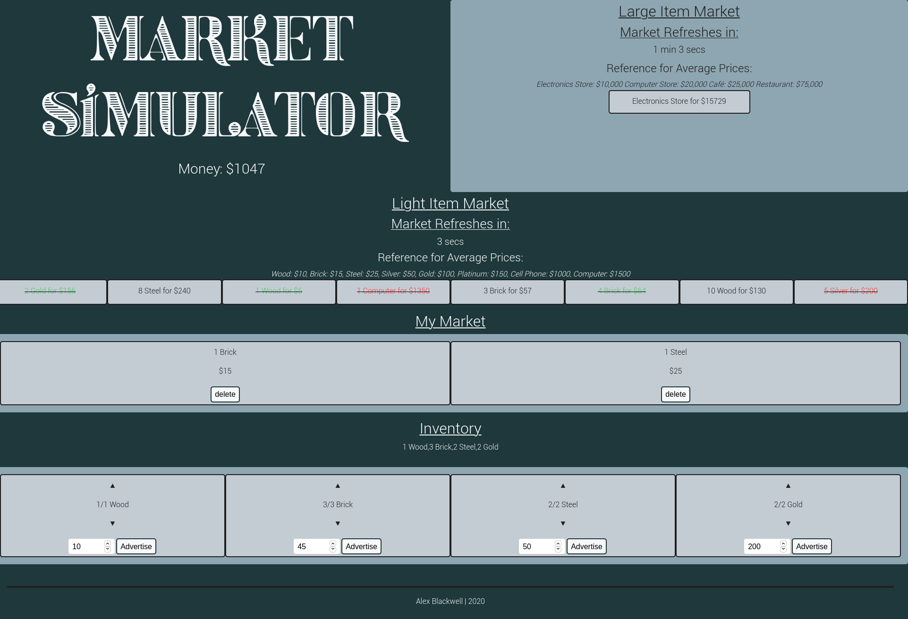
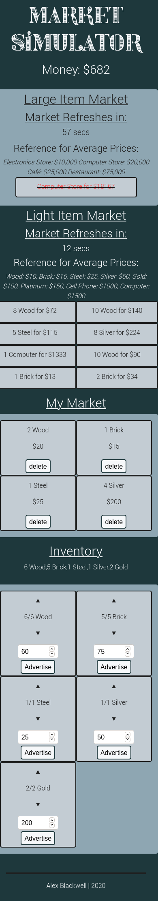

# AP Computer Science Principles Market Game

The purpose of this program was to simulate a fast pace market environment that rewards quickly buying at a low price and selling high where the product is still competitively priced.
The market game at its most fundamental is a large market which sells expensive items with a longer refresh time and a light market that sells less expensive items at a faster refresh interval. The motive of the game is not indifferent from an actual market as items can be bought for a low price and sold for a high price. However, the better the deal the item is the faster it will sell in the live market. If the item sells it will be shown as crossed out and it will no longer be available for purchase. A similar time related selling algorithm is implemented on the users own market. This algorithm is an exponential function where x is the price and y is the amount of time it will take for the item to sell. The game starts with $1000 and from there it is up to the user to make money by buying both the light and large items at a low price and selling high.

This program is currently being hosted [here](https://alex0blackwell.github.io/pages/market/index.html) as of 12/05/2020
note this program does not work on safari on the phone.

## Photo of the program 

## Photo showing the scalability of the program on the phone

